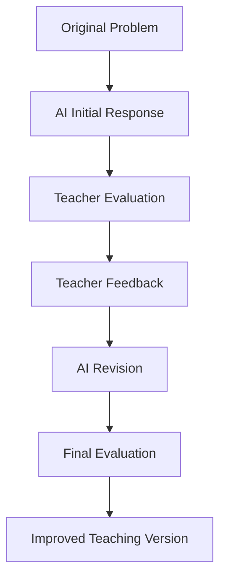

# AI Physics Evaluation Benchmark

## Project Overview

AI Physics Evaluation Benchmark is an ongoing benchmark of real teacher-AI interactions in high school physics. It evaluates whether large language models can reason through physics problems and explain them in a way that supports student learning.

This project is designed for AI Evaluation, AI Tutor, RLHF, and educational benchmark use cases. It focuses not only on final-answer correctness, but also on the reasoning and teaching process behind the answer.

## Goal

The goal is to evaluate large language models in high school physics reasoning and instruction across five dimensions:

- Physical Modeling
- Reasoning
- Teaching
- Error Recovery
- Evaluation Workflow

## Evaluation Workflow



## Evaluation Framework

All cases use a shared rubric covering physics accuracy, physical modeling, reasoning consistency, teaching quality, and error recovery. See [evaluation_framework.md](evaluation_framework.md).

## Repository Structure

```text
AI-Physics-Evaluation-Benchmark/
├── README.md
├── evaluation_framework.md
├── statistics.md
├── overall_findings.md
├── cases/
│   ├── case001.md
│   ├── case002.md
│   ├── case003.md
│   ├── case004.md
│   └── case005.md
└── assets/
    ├── case001_problem.png
    ├── case002_problem.png
    ├── case003_problem.png
    ├── case004_problem.png
    └── case005_problem.png
```

## Current Statistics

| Metric | Value |
|---|---:|
| Total Cases | 5 |
| Models Evaluated | ChatGPT |
| Total AI Responses | 18 |
| Major Error Categories | 5 |

See [statistics.md](statistics.md) and [overall_findings.md](overall_findings.md) for the current dataset summary.

## Cases

| Case | Topic | Primary Failure |
|---|---|---|
| [Case 001](cases/case001.md) | Electromagnetism | Physical Modeling |
| [Case 002](cases/case002.md) | Mechanics | Physical Modeling |
| [Case 003](cases/case003.md) | Electromagnetism | Geometry Interpretation |
| [Case 004](cases/case004.md) | Electromagnetism | Conditional Reasoning |
| [Case 005](cases/case005.md) | Mechanics | Constraint Modeling |
