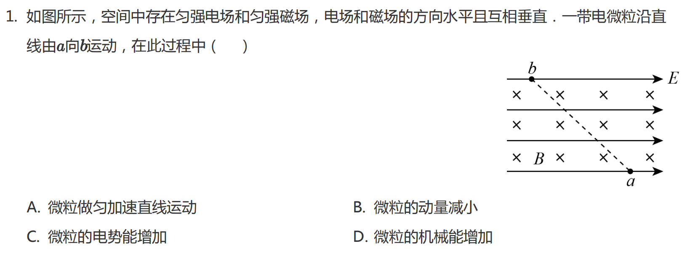

# Case 001: Multi-round Reasoning in Electromagnetism

## Basic Information

| Item | Content |
|---|---|
| Topic | Electromagnetism |
| Subtopic | Electric Field, Magnetic Field, Force Analysis |
| Grade | High School |
| Difficulty | ★★★★☆ |
| Primary Failure | Physical Modeling |
| Secondary Failure | Force Analysis |
| Correction Rounds | 5 |
| AI Model | ChatGPT |
| Evaluation Type | Multi-round Reasoning Evaluation |

## Original Problem

A charged particle moves along a straight line from point **a** to point **b** in a region containing a uniform electric field and a uniform magnetic field.

The electric field and magnetic field are perpendicular to each other. The problem asks which statement must always be true during the motion.

## AI Initial Response

The AI concluded that the correct answer was

$$
\boxed{C}
$$

It assumed that only the electric force and Lorentz force needed to be considered. The reasoning focused on the work done by the electric field while ignoring whether the assumed force system could actually produce straight-line motion.

## Evaluation

### Round 1

**AI Assumption**

Only the electric force and Lorentz force determine the motion.

**Evaluation**

Incorrect physical model. If only these two forces act on the particle, the electric force changes the particle's speed, which changes the Lorentz force. Therefore the force balance cannot remain unchanged, and straight-line motion is impossible.

### Round 2

**AI Revision**

The AI concluded that the electric field must be perpendicular to the velocity so that the speed remains constant.

**Evaluation**

Missing external force. The problem states that both the electric field and magnetic field are horizontal, so gravity must be included in the force analysis.

### Round 3

**AI Revision**

The AI added gravity into the analysis and changed its answer to **B**.

**Evaluation**

Charge sign not determined. The direction of the electric force depends on the sign of the particle's charge and must be inferred from the motion.

### Round 4

**AI Revision**

The AI inferred that the particle was negatively charged and changed its answer to **D**.

**Evaluation**

Dynamic equilibrium not verified. The Lorentz force depends on speed:

$$
F_B=|q|vB
$$

If the speed changes, the Lorentz force changes, and the force balance cannot remain valid during the entire motion.

### Round 5

The AI finally recognized that the particle can move along a straight line only if the three forces remain in equilibrium throughout the motion:

$$
q\vec E+q\vec v\times\vec B+m\vec g=0
$$

Therefore, the particle moves with constant velocity, kinetic energy remains constant, gravitational potential energy increases, and mechanical energy increases.

Final answer:

$$
\boxed{D}
$$

## Teacher Feedback

The force analysis must include all forces, including gravity. The charge sign and speed-dependence of the Lorentz force also need to be checked before selecting the answer.

The key correction is that straight-line motion is possible only when the full force system remains self-consistent throughout the motion.

## AI Revision

After several correction rounds, the AI revised the model to include electric force, Lorentz force, and gravity. It also recognized that constant straight-line motion requires a stable three-force equilibrium.

The final revised answer is **D**.

## Final Evaluation

| Category | Rating |
|---|---|
| Physics Accuracy | ⭐⭐⭐⭐⭐ |
| Physical Modeling | ⭐⭐⭐☆☆ |
| Assumption Verification | ⭐⭐☆☆☆ |
| Teaching Quality | ⭐⭐⭐⭐☆ |
| Error Recovery | ⭐⭐⭐⭐⭐ |

The model eventually reached the correct answer after several rounds of feedback. However, each revision corrected only the most recently identified mistake, and the AI did not proactively verify whether all physical assumptions were self-consistent before continuing.

## Teacher Notes

This case demonstrates a common weakness of large language models: the model adjusts its reasoning after each discovered contradiction instead of checking the complete physical model first.

Students often make a similar mistake by solving immediately after reading the problem. A more reliable strategy is to identify every force, check whether straight-line motion is possible, determine whether speed must remain constant, infer the charge sign, and only then write equations.

## Improved Teaching Version

Before writing equations, ask what forces act on the particle. The particle is subjected to electric force, Lorentz force, and gravity.

Next, check whether the particle can move along a straight line. If the speed changes, then

$$
F_B=|q|vB
$$

also changes, so the force balance cannot remain unchanged.

The three forces must remain in equilibrium during the entire motion:

$$
q\vec E+q\vec v\times\vec B+m\vec g=0
$$

Thus velocity is constant, kinetic energy remains constant, and mechanical energy increases because gravitational potential energy increases.

Therefore,

$$
\boxed{D}
$$

## Teaching Reminder

A correct solution begins with force analysis, not equation writing. Before applying any formula, always verify that the assumed physical model is internally consistent.
