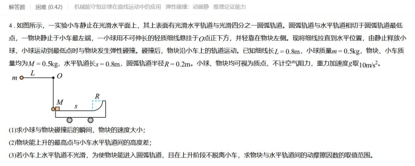

# Case 002: Movable Cart and Relative Motion

## Basic Information

| Item | Content |
|---|---|
| Topic | Mechanics |
| Subtopic | Collision and Relative Motion |
| Grade | High School |
| Difficulty | ★★★★☆ |
| Primary Failure | Physical Modeling |
| Secondary Failure | Reference Object Assumption |
| Correction Rounds | 1 |
| AI Model | ChatGPT |
| Evaluation Type | AI Solution Review |

## Original Problem

## AI Initial Response

The AI assumed that **the cart remained stationary** during the motion. As a result, it used

$$
\frac{1}{2}Mv^{2}
$$

as the available kinetic energy and obtained

$$
\boxed{0.75 \le \mu < 1}
$$

This answer is incorrect.

## Evaluation

| Category | Evaluation |
|---|---|
| Final Answer | Incorrect |
| Main Issue | The cart was incorrectly treated as fixed |
| Modeling Error | The system should be analyzed using relative motion |

The AI implicitly assumed that the cart was fixed to the ground. However, the cart is free to move because the ground is frictionless.

Therefore, the available energy should be analyzed using relative motion, not the block's kinetic energy relative to the ground.

## Teacher Feedback

Question 3 is incorrect. The cart is not stationary. It moves because of friction.

## AI Revision

After receiving feedback, the AI immediately corrected its physical model. It replaced the original energy analysis with the relative-motion energy

$$
E_{\text{relative}}=\frac{1}{4}Mv^{2}
$$

and finally obtained

$$
\boxed{\frac{1}{4}\le\mu<\frac{1}{2}}
$$

which is the correct answer.

## Final Evaluation

| Category | Rating |
|---|---|
| Physics Accuracy | ⭐⭐⭐⭐⭐ |
| Physical Modeling | ⭐⭐⭐☆☆ |
| Assumption Verification | ⭐⭐☆☆☆ |
| Teaching Quality | ⭐⭐⭐⭐☆ |
| Error Recovery | ⭐⭐⭐⭐⭐ |

The model showed excellent correction ability after receiving feedback. However, it failed to verify a key physical assumption before solving the problem.

For educational applications, this type of mistake may mislead students even though the final correction is accurate.

## Teacher Notes

This is a typical modeling error rather than a calculation error. Many students instinctively use the block's kinetic energy relative to the ground.

The real question should always be: **Is the supporting object fixed or movable?** If the cart can move, the relative-motion energy must be used instead.

## Improved Teaching Version

Before writing any equations, ask whether the cart can move. Since the ground is frictionless, the answer is yes.

Therefore, the block's kinetic energy relative to the ground cannot be directly used. Instead, analyze the relative motion between the block and the cart.

The initial relative kinetic energy is

$$
E_{\text{relative}}=\frac{1}{4}Mv^{2}
$$

Using this energy, the two conditions are

$$
\mu<\frac{1}{2}
$$

and

$$
\mu\ge\frac{1}{4}
$$

Therefore,

$$
\boxed{\frac{1}{4}\le\mu<\frac{1}{2}}
$$

## Teaching Reminder

Before applying energy conservation, always ask whether the reference object is fixed. For movable systems, analyze the relative motion first.
