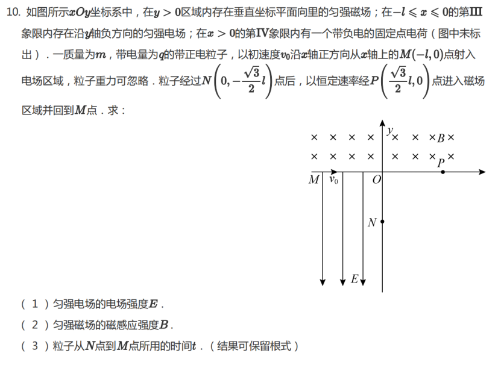

# Case 003: Geometry Error in Circular Motion

## Basic Information

| Item | Content |
|---|---|
| Topic | Electromagnetism |
| Subtopic | Circular Motion, Charged Particle Motion |
| Grade | High School |
| Difficulty | ★★★★☆ |
| Primary Failure | Geometry Interpretation |
| Secondary Failure | Assumption Verification |
| Correction Rounds | 1 |
| AI Model | ChatGPT |
| Evaluation Type | Geometry Error Review |

## Original Problem

A charged particle moves through electric and magnetic fields. The problem asks for the electric field strength, magnetic field strength, and the time required for the particle to move from point **N** to point **M**.

The evaluation focuses on **Question 3**, where the model made an error in determining the central angle of the circular arc from **N** to **P**.

## AI Initial Response

The AI calculated the motion time from **N** to **M** by splitting it into two parts: motion from **N** to **P**, and motion from **P** to **M**.

For the arc from **N** to **P**, the AI assumed the central angle was

$$
150^\circ=\frac{5\pi}{6}
$$

and obtained

$$
t_{NP}=\frac{5\pi(3-\sqrt{3})l}{24v_0}
$$

Then it combined this with the time from **P** to **M** and gave the final result

$$
\boxed{t=\frac{\pi l(19-3\sqrt{3})}{24v_0}}
$$

This answer is incorrect.

## Evaluation

| Category | Evaluation |
|---|---|
| Final Answer | Incorrect |
| Main Issue | Wrong central angle |
| Modeling Error | The model chose the minor arc instead of the actual traveled arc |

The physical method was mostly correct: the AI correctly decomposed the motion into two circular-motion segments. However, it misread the geometry of the trajectory.

The central angle from **N** to **P** is not

$$
150^\circ
$$

but

$$
210^\circ=\frac{7\pi}{6}
$$

This changes the arc length and therefore the motion time.

## Teacher Feedback

Question 3 is incorrect. The central angle from **N** to **P** is 210 degrees.

## AI Revision

After receiving feedback, the AI corrected the central angle:

$$
210^\circ=\frac{7\pi}{6}
$$

Therefore,

$$
t_{NP}=\frac{r_1\cdot\frac{7\pi}{6}}{2v_0}
$$

where

$$
r_1=\frac{3-\sqrt{3}}{2}l
$$

So,

$$
t_{NP}=\frac{7\pi(3-\sqrt{3})l}{24v_0}
$$

For the motion from **P** to **M**,

$$
t_{PM}=\frac{\pi(2+\sqrt{3})l}{12v_0}
$$

Thus,

$$
t=t_{NP}+t_{PM}
$$

$$
t=\frac{7\pi(3-\sqrt{3})l}{24v_0}+\frac{2\pi(2+\sqrt{3})l}{24v_0}
$$

$$
t=\frac{\pi l}{24v_0}\left(21-7\sqrt{3}+4+2\sqrt{3}\right)
$$

Final answer:

$$
\boxed{t=\frac{\pi l(25-5\sqrt{3})}{24v_0}}
$$

## Final Evaluation

| Category | Rating |
|---|---|
| Physics Accuracy | ⭐⭐⭐⭐⭐ |
| Physical Modeling | ⭐⭐⭐⭐☆ |
| Assumption Verification | ⭐⭐⭐☆☆ |
| Teaching Quality | ⭐⭐⭐⭐☆ |
| Error Recovery | ⭐⭐⭐⭐⭐ |

The AI did not make a major formula error. Its main weakness was geometric interpretation.

The model could apply the formula for circular-motion time, but it failed to correctly identify the arc angle before substituting values.

## Teacher Notes

This is a typical error in charged-particle circular-motion problems. Students often know the formula

$$
t=\frac{r\theta}{v}
$$

but choose the wrong central angle.

The key is not only knowing the formula, but also deciding whether the particle travels along the minor arc or the major arc.

## Improved Teaching Version

For Question 3, do not start by calculating time immediately. First determine the actual arc traveled by the particle.

The time for circular motion is

$$
t=\frac{r\theta}{v}
$$

where $\theta$ must be measured in radians.

For the motion from **N** to **P**, the particle travels along the larger arc, so

$$
\theta_{NP}=210^\circ=\frac{7\pi}{6}
$$

Thus,

$$
t_{NP}=\frac{r_1\theta_{NP}}{2v_0}
$$

$$
t_{NP}=\frac{\frac{3-\sqrt{3}}{2}l\cdot\frac{7\pi}{6}}{2v_0}
$$

$$
t_{NP}=\frac{7\pi(3-\sqrt{3})l}{24v_0}
$$

For the motion from **P** to **M**,

$$
t_{PM}=\frac{\pi(2+\sqrt{3})l}{12v_0}
$$

Therefore,

$$
t=t_{NP}+t_{PM}
$$

$$
t=\frac{7\pi(3-\sqrt{3})l}{24v_0}+\frac{2\pi(2+\sqrt{3})l}{24v_0}
$$

$$
\boxed{t=\frac{\pi l(25-5\sqrt{3})}{24v_0}}
$$

## Teaching Reminder

In circular-motion problems, the formula is usually simple. The real difficulty is choosing the correct arc.

Before calculating time, always determine which arc the particle actually travels along.
