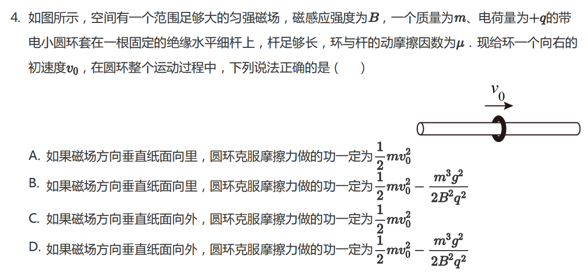

# Case 004: Overgeneralization in a Magnetic Force Problem

## Basic Information

| Item | Content |
|---|---|
| Topic | Electromagnetism |
| Subtopic | Lorentz Force, Friction, Conditional Reasoning |
| Grade | High School |
| Difficulty | ★★★★☆ |
| Primary Failure | Conditional Reasoning |
| Secondary Failure | Assumption Verification |
| Correction Rounds | 1 |
| AI Model | ChatGPT |
| Evaluation Type | Overgeneralization Review |

## Original Problem

A positively charged small ring moves along a horizontal rod in a uniform magnetic field.

The problem asks which option must be correct under the given conditions. The evaluation focuses on whether the AI can distinguish between a possible situation and a statement that must always be true.

## AI Initial Response

The AI concluded that the correct answer was

$$
\boxed{B,C}
$$

For one magnetic-field direction, the AI assumed that the Lorentz force could eventually balance gravity:

$$
qvB=mg
$$

Then it concluded that the ring would finally move at

$$
v=\frac{mg}{qB}
$$

and obtained the friction work in option **B**:

$$
W_f=\frac{1}{2}mv_0^{2}-\frac{m^{3}g^{2}}{2B^{2}q^{2}}
$$

For the opposite magnetic-field direction, it concluded that the ring would eventually stop, so option **C** was also correct.

The initial answer was

$$
\boxed{B,C}
$$

This answer is incorrect.

## Evaluation

| Category | Evaluation |
|---|---|
| Final Answer | Incorrect |
| Main Issue | A possible motion scenario was treated as guaranteed |
| Modeling Error | The condition on initial speed was not checked |

For the magnetic field direction where the Lorentz force is upward, the condition

$$
qvB=mg
$$

can only be reached if the initial speed is large enough.

If

$$
v_0>\frac{mg}{qB}
$$

then the ring may slow down until the normal force becomes zero. However, if

$$
v_0\le\frac{mg}{qB}
$$

the ring never reaches a zero-pressure state. In that case, friction remains present and the ring eventually stops.

Therefore, option **B** is not always true.

## Teacher Feedback

Option **B** is not necessarily correct. The statement assumes that the initial speed is large enough for the Lorentz force to exceed gravity, but this is not guaranteed by the problem.

## AI Revision

After receiving feedback, the AI corrected its reasoning. It recognized that for the magnetic field direction where the Lorentz force is upward,

$$
N=mg-qvB
$$

and option **B** is valid only if

$$
v_0>\frac{mg}{qB}
$$

If

$$
v_0\le\frac{mg}{qB}
$$

the ring still experiences pressure and friction, and it eventually stops.

For the opposite magnetic-field direction, the Lorentz force is downward, so the normal force always exists and the ring must eventually stop.

Thus the only statement that must be true is

$$
\boxed{C}
$$

## Final Evaluation

| Category | Rating |
|---|---|
| Physics Accuracy | ⭐⭐⭐⭐⭐ |
| Physical Modeling | ⭐⭐⭐⭐☆ |
| Assumption Verification | ⭐⭐⭐☆☆ |
| Teaching Quality | ⭐⭐⭐⭐☆ |
| Error Recovery | ⭐⭐⭐⭐⭐ |

The model correctly revised its answer after receiving feedback. The original error was not a formula error; it was a logical error.

The AI failed to distinguish between a conditionally possible result and a result that must always occur.

## Teacher Notes

This is a typical mistake in both student reasoning and AI reasoning. The model found a physically possible endpoint and assumed it must happen.

High school physics problems often test whether a conclusion is guaranteed under all allowed initial conditions. In this problem, option **B** requires an additional condition on $v_0$, so it cannot be selected as a statement that must be true.

## Improved Teaching Version

The key word in this problem is **must**. We need to check whether each option is true under all possible allowed situations.

Consider the magnetic field direction where the Lorentz force is upward. The normal force is

$$
N=mg-qvB
$$

The state

$$
qvB=mg
$$

is possible only if the initial speed is large enough.

If

$$
v_0>\frac{mg}{qB}
$$

then the ring may lose contact with the rod, and option **B** may apply. But if

$$
v_0\le\frac{mg}{qB}
$$

then the ring never reaches that zero-pressure state. It continues to experience friction and eventually stops.

Therefore, option **B** is not guaranteed.

For the opposite magnetic-field direction, the Lorentz force is downward, so the pressure on the rod is always present. Friction always acts against the motion, and the ring eventually stops.

Thus the work done by friction equals the loss of all initial kinetic energy:

$$
W_f=\frac{1}{2}mv_0^{2}
$$

Therefore,

$$
\boxed{C}
$$

## Teaching Reminder

When a problem asks what **must** be true, do not stop at finding a possible solution. Always check whether the conclusion holds under every allowed condition.
