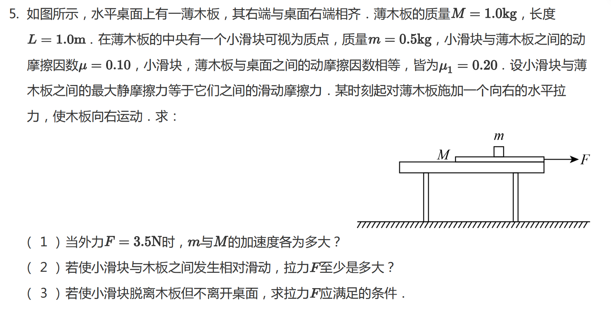

# Case 005: Reference Frame Consistency and Constraint Modeling

## Basic Information

| Item | Content |
|---|---|
| Topic | Mechanics |
| Subtopic | Friction, Relative Motion, Constraint Conditions |
| Grade | High School |
| Difficulty | ★★★★★ |
| Primary Failure | Constraint Modeling |
| Secondary Failure | Reference Frame Consistency |
| Correction Rounds | 5 |
| AI Model | ChatGPT |
| Evaluation Type | Multi-step Model Correction Failure Analysis |

## Original Problem

A block is placed on a finite-length wooden board on a horizontal table. A horizontal force $F$ is applied to the board.

The block may initially move together with the board, then slide relative to the board, and eventually leave the board and move on the table.

The key requirement is that the block must slide off the board, but must not leave the table. The table has finite length, visible from the diagram.

## AI Initial Response

The AI correctly identified the onset of sliding:

$$
F>4.5
$$

It then incorrectly treated the problem as a purely relative-motion constraint problem. It assumed that preventing the block from leaving the system depends only on relative displacement within the board.

This led to an incorrect conclusion that no valid solution exists.

## Evaluation

### Round 1: Wrong constraint interpretation

**AI Assumption**

The condition is equivalent to limiting relative displacement.

**Evaluation**

Incorrect model definition. The constraint is not relative displacement; it is absolute displacement of the block relative to the table, not relative displacement on the board.

### Round 2: Missing staged motion model

**AI Revision**

The AI introduced a three-stage model: co-acceleration, relative sliding, and detachment.

**Evaluation**

Mixed reference frame inconsistency. The block first moves with the board in the ground frame, so absolute motion must be tracked.

### Round 3: Attempted correction in ground frame

**AI Revision**

The AI switched to ground frame analysis and derived motion equations.

**Evaluation**

Partial correction but inconsistent formulation. It still used relative acceleration to compute velocity and treated board and block motion inconsistently.

### Round 4: Correct identification of spatial constraint

**AI Revision**

The AI correctly identified:

$$
s_{\text{board}}+s_{\text{table}}=\frac{L}{2}
$$

**Evaluation**

Misclassification of constraint type. This is not a single-point equality condition; it must be treated as an inequality constraint because the block must not exceed the table boundary.

### Round 5: Final AI Result

The AI finally expressed the full motion in the table frame:

$$
a_m=1
$$

$$
a_M=F-3.5
$$

with the block position constraint

$$
s\le\frac{L}{2}
$$

Final result:

$$
\boxed{F\ge 6}
$$

## Teacher Feedback

The constraint is absolute displacement relative to the table, not relative displacement on the board.

The problem must be solved in a consistent reference frame, and the final spatial condition must be handled as an inequality constraint rather than a single equality point.

## AI Revision

After multiple correction rounds, the AI moved toward a table-frame analysis. It identified the relevant accelerations and the final position constraint:

$$
a_m=1,\qquad a_M=F-3.5,\qquad s\le\frac{L}{2}
$$

The final revised result is

$$
\boxed{F\ge 6}
$$

## Final Evaluation

| Category | Rating |
|---|---|
| Physics Accuracy | ⭐⭐⭐⭐☆ |
| Physical Modeling | ⭐⭐⭐☆☆ |
| Assumption Verification | ⭐⭐☆☆☆ |
| Teaching Quality | ⭐⭐⭐⭐⭐ |
| Error Recovery | ⭐⭐⭐⭐⭐ |

The final result is correct, but the reasoning process was fragile. The main weakness was not calculation; it was the interpretation of constraints and inconsistent reference-frame handling.

## Teacher Notes

This problem is difficult because it mixes three layers: co-moving system, relative sliding, and absolute spatial constraint.

The AI repeatedly failed because it switched between relative-frame reasoning and ground-frame reasoning without fixing a single consistent framework.

## Improved Teaching Version

Analyze everything in the table, or ground, frame.

First identify the accelerations:

$$
a_m=1
$$

$$
a_M=F-3.5
$$

Sliding occurs when

$$
F>4.5
$$

The block must leave the board but not exceed the table boundary. Thus the total displacement constraint is

$$
s_{\text{board}}+s_{\text{table}}\le\frac{L}{2}
$$

This leads to

$$
\frac{3L}{4(F-4.5)}\le\frac{L}{2}
$$

Therefore,

$$
F\ge 6
$$

## Teaching Reminder

In multi-body systems, always distinguish between relative motion constraints, absolute spatial constraints, and reference frame choice.
